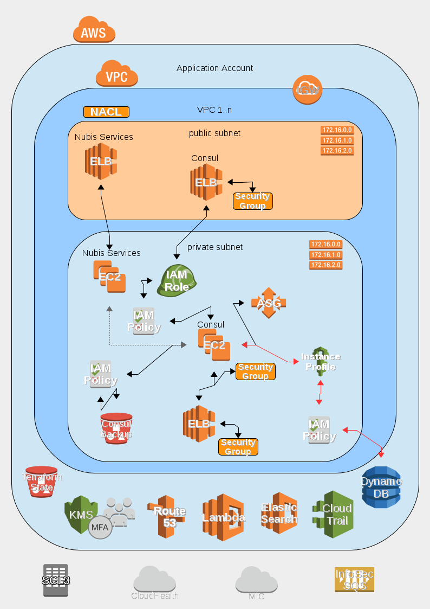

# nubis-consul

[](https://github.com/nubisproject/nubis-consul/releases)
[](https://travis-ci.org/nubisproject/nubis-consul)
[](https://github.com/nubisproject/nubis-consul/issues)

## Consul Deployment


The Consul stack is designed to be deployed into a standard Nubis Account. It takes advantage of the standard deployment found [here](https://github.com/nubisproject/nubis-docs/blob/master/DEPLOYMENT_OVERVIEW.md)

The Nubis Consul deployment consists of:
 - Instances deployed on EC2 in an Auto Scaling group
 - An external Elastic Load Balancer (ELB) which has a Security Group which restricts access to a list of IP addresses. The primary function is to allow access to the Continuous Integration (CI) system in the Admin VPC.
 - An internal Elastic Load Balancer (ELB) with a Security Group which restricts access to Nubis Deployed Instances. The function of this ELB is to provide access to instances running within the VPC and ensures a stable endpoint in the event of AutoScaling.
 - A Dynamo DB table which contains startup configuration information. This information is encrypted at rest. The EC2 instances are created with an IAM instance profile which allows access to a KMS key which is used to decrypt the configuration information.
 - A S3 bucket which contains backup data. This bucket is accessible only to Consul EC2 instances via an IAM Policy which is attached at boot via the AutoScaling Launch Configuration.
 


### Dependencies

You need [credstash](https://github.com/fugue/credstash) locally installed (in your PATH) to be able to deploy Consul

Mozilla Nubis Consul

You need to run

```bash
$> nubis/bin/makecert
```

Before deploying, to generate the SSL key and cert

### Building project
This assumes you are in the project directory

* Build AMI and make note of AMI ID

    ```bash
    nubis-builder build
    ```

* Generate certificate

    ```bash
    cd nubis/terraform
    ../bin/makecert
    ```

* Configure tfvars file

    ```bash
    cd nubis/terraform
    cp terraform.tfvars-dist terraform.tfvars
    <edit tfvar files with appropriate info>
    ```

* Check if terraform plan gives you the right info (for sanity sake)

    ```bash
    cd nubis/terraform
    terraform plan
    ```

* Verify if output looks sane and then deploy

    ```bash
    terraform apply
    ```

* ???
* Profit

### NOTE
